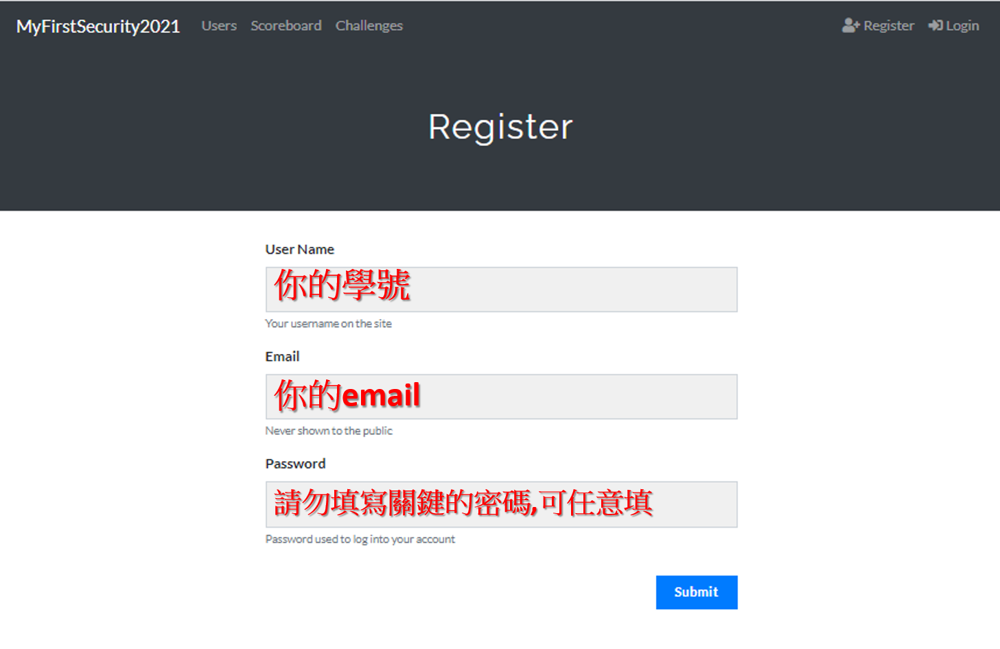
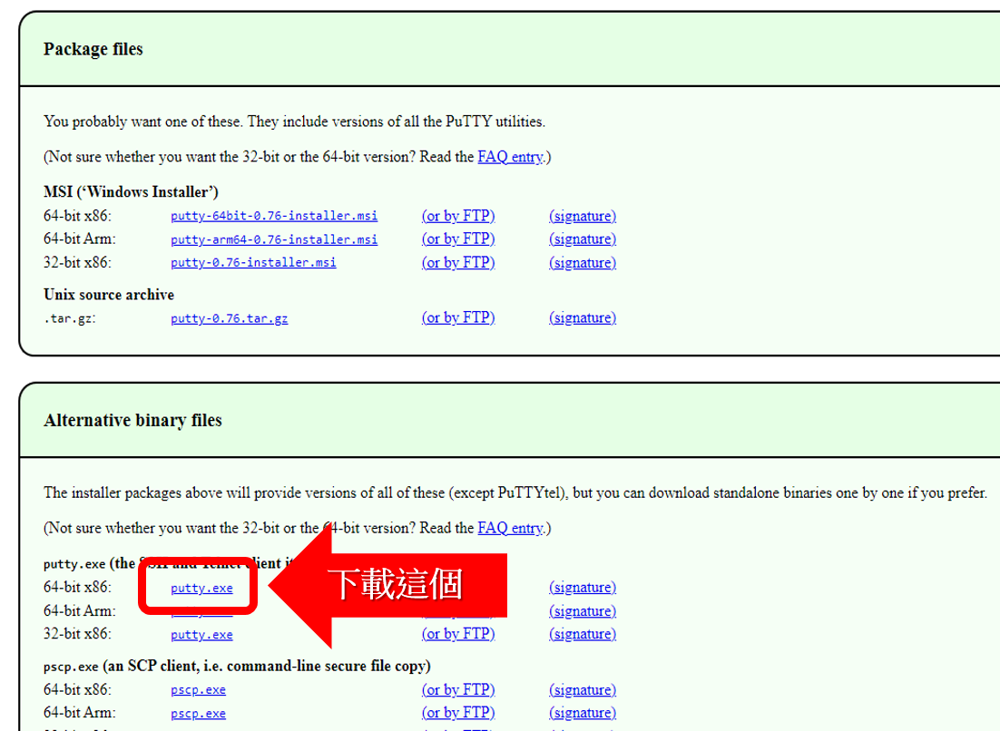

# MyFirstSecurity資安體驗營
```
本課程引領學生透過CTF解題來學習資訊安全的觀念與技術。
課程內容包括基礎的編碼與解碼(ASCII/BASE 64/Base32/Morse)與Linux基本觀念及入門指令。
課程將以基礎CTF解題做為提高學生學習的學習配套。
```
```
引領學生戰鬥中學CTF搶旗大賽，透過實戰演練來掌握資安駭客技術，
更重要的是我們規劃的趣味性CTF題目會讓你充滿自信，
享受一個Happy Hacking Day!!
```

- 【本次課程從基礎教起，只要你會電腦及強烈的學習態度即可!】

# 課程內容與時程

## 開場白
- 上課之前 一定要宣讀 [資安倫理宣言](資安宣言.gif)


- 適合高中職學生學習資安的好去處[【高中職生資安研習營】 別忘了 按讚 給我們鼓勵](https://zh-tw.facebook.com/pages/category/Community/高中職生資安研習營-455550404836569/)

## 正式上課
- 學習資安技能的超趣活動--[CTF搶旗大賽](CTF搶旗大賽.md)解題實戰
- 註冊與登入CTF 
- 起手式---word隱寫術
- (*)[Hitcon CTF](https://ctf2017.hitcon.org/) 實體課程才有
- 簡單的網頁解題 
- 編碼與解碼
- 古典密碼之破密分析
- [下載putty](https://www.chiark.greenend.org.uk/~sgtatham/putty/latest.html)
- [linux 基礎指令與簡易安全觀念](linux入門.md)

## 上完課後
- 上完課後要填問卷調查,仔細填寫(要發證書的!)

# 註冊與登入CTF 

- [登入CTF平台(上課使用的平台)](http://140.110.112.211) 
- [崑山科技大學備援平台]  (http:)
- 註冊(register) ==> 點選右上角register按鈕



# 使用putty遠端連線

- [下載putty](https://www.chiark.greenend.org.uk/~sgtatham/putty/latest.html)
- 下載putty的版本



# [實體活動]時程表
```
[D]活動記錄{20-30分鐘}
[D1]填寫問卷
[D2]到粉絲頁 按讚
    高中職生資安研習營
[D3]大合照
```
